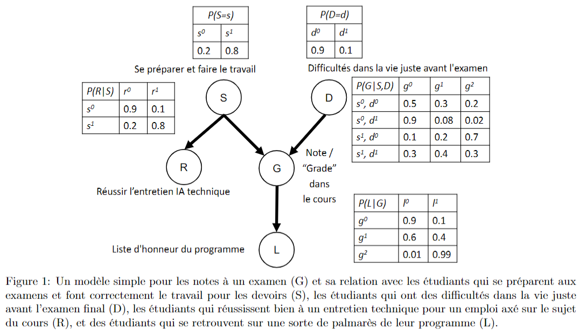

# Bayesian Network Analysis Report

## Introduction
This report presents an in-depth analysis of a Bayesian network consisting of 5 variables and their probabilistic relationships.

## Network Structure


The network consists of:
- 5 variables (nodes): S, D, R, G, L
- 4 directed edges with conditional probabilities: S→R, S→G, D→G, G→L

## Probability Tables
To be more efficient, we define the probability tables in numpy array, with the following API

```
P(S=s0) = P_S[0]
P(D=d1) = P_D[1]
P(R=r1|S=s0) = P_R_S[1,0]
P(G|S=s0,D=d1) = P_G_SD[0,1] = P_G_SD[0,1,:]
P(L|G=g0) = P_L_G[:,0]
```

## Key Probability Calculations

### 1. Basic Probability Distributions

#### a) Marginal Distribution of G
Calculated using three different methods:

**Method 1 (Direct marginalization):**
$$P(G) = P(G|S,D)P(S,D) = \sum_{s,d} P(G|S=s,D=d)P(S=s)P(D=d)$$

**Method 2 (Full joint distribution):**
$$P(G) = \sum_{s,d,r,l} P(S=s)P(D=d)P(R=r|S=s)P(G|S=s,D=d)P(L=l|G)$$

**Method 3 (Reduced joint distribution):**
$$P(G) = \sum_{s,d,r} P(S=s)P(D=d)P(R=r|S=s)P(G|S=s,D=d)$$

**Result:**
```diff
! [0.204, 0.2316, 0.5644]
```

### 2. Conditional Distributions

#### G Given R
**b) P(G|R=r1):**
$$P(G|R=r1) = \frac{P(G,R=r1)}{P(R=r1)} = \frac{\sum_{s,d} P(S=s)P(D=d)P(R=r1|S=s)P(G|S=s,D=d)}{P(R=r1)}$$

**Result:**
```diff
! [0.13272727, 0.22175758, 0.64551515]
```

**c) P(G|R=r0):**
$$P(G|R=r0) = \frac{P(G,R=r0)}{1-P(R=r1)}$$

**Result:**
```diff
! [0.34235294, 0.25070588, 0.40694118]
```

**d) P(G|R=r1,S=s0) and e) P(G|R=r0,S=s0):**
$$P(G|R,S=s0) = \sum_d P(G|S=s0,D=d)P(D=d)$$
**Important Note:** Both give the same result as G is conditionally independent of R given S

**Result:**
```diff
! [0.54, 0.278, 0.182]
```

### 3. Independence Properties

#### R and D Independence
**f) P(R|D=d1) and g) P(R|D=d0):**
$$P(R|D) = P(R)$$ 
Due to marginal independence between R and D

**Result:**
```diff
! [0.34, 0.66]
```

#### Conditional Dependencies
**h) P(R|D=d1,G=g2):**
$$P(R|D,G=g2) = \frac{\sum_s P(S=s)P(D)P(R|S=s)P(G=g2|S=s,D)}{P(D,G=g2)}$$

**Result:**
```diff
! [0.21147541, 0.78852459]
```

**i) P(R|D=d0,G=g2):**

**Result:**
```diff
! [0.24666667, 0.75333333]
```

**j) P(R|D=d1,L=l1):**
$$P(R|D,L=l1) = \frac{\sum_{s,g} P(S=s)P(D)P(R|S=s)P(G=g|S=s,D)P(L=l1|G=g)}{P(D,L=l1)}$$

**Result:**
```diff
! [0.24749737, 0.75250263]
```

**k) P(R|D=d0,L=l1):**

**Result:**
```diff
! [0.2736, 0.7264]
```

### 4. Causal Analysis (do-calculus)

#### Intervention on G
**l) P(R|do(G=g2)):**
Due to breaking the causal relationship between S and G:
$$P(R|do(G=g2)) = P(R)$$

**Result:**
```diff
! [0.34, 0.66]
```

Compare with observational probability:
**m) P(R|G=g2):** 

**Result:**
```diff
! [0.24514529, 0.75485471]
```

**n) P(R):**

**Result:**
```diff
! [0.34, 0.66]
```

#### Intervention on L
**o) P(G|do(L=l1)):**
As L is a descendant of G:
$$P(G|do(L=l1)) = P(G)$$

**Result:**
```diff
! [0.204, 0.2316, 0.5644]
```

**p) P(G=g1|L=l1):**
$$P(G=g1|L=l1) = \frac{P(L=l1|G=g1)P(G=g1)}{\sum_g P(L=l1|G=g)P(G=g)}$$

**Result:**
```diff
! 0.13789900505510605
```


## Skills Acquired

1. **Probabilistic Reasoning**:
   - Mastery of joint probability decomposition
   - Understanding of conditional independence

2. **Bayesian Network Analysis**:
   - Ability to compute marginal and conditional probabilities
   - Understanding of d-separation and causal relationships

3. **Programming Skills**:
   - Implementation of probabilistic calculations in Python
   - Use of NumPy for probability computations

4. **Causal Inference**:
   - Understanding of do-calculus
   - Distinction between observational and interventional probabilities

## Conclusion
This analysis demonstrates the power of Bayesian networks in modeling complex probabilistic relationships and causal effects. The implementation successfully validates theoretical probabilities through computational methods.
